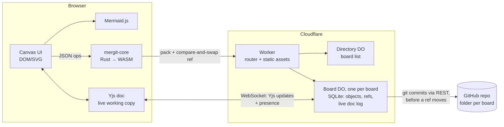

# mergit: plan

A Miro-style infinite whiteboard where every diagram is **Mermaid text**, and the
board has **real version control** built in: commits, branches, diffs, merges, and
history you can scrub through visually.

> One-line pitch: *Figma's canvas, Mermaid's diagrams-as-code, git's history, and a
> diff view that says "added node Refunded" instead of "+3 −1 lines".*

---

## 1. Principles

1. **Text is the source of truth.** Every diagram is Mermaid source. Anything the GUI
   does (drag a connector, rename a node) is ultimately an edit to that text. This
   is what makes diff, merge and git interop tractable.
2. **History is a first-class UI, not a backup.** Branching, comparing and restoring
   should feel as natural as undo.
3. **Local-first.** The board and its full history live on your machine and work
   offline. Sync is an add-on, not a requirement.
4. **One core, many shells.** The version-control and diagram logic is a single Rust
   crate. It compiles to WebAssembly for the browser and to native code for a CLI,
   a sync server and a desktop app.
5. **Semantic over textual.** Diffs, merges and conflict views should understand
   Mermaid structure (nodes, edges, participants) wherever we can parse it, and fall
   back to lines where we can't.

## 2. "Should it be WebAssembly?" Yes, but only for the core

| Layer | Tech | Why |
|---|---|---|
| VCS engine (objects, refs, merge, diff) | **Rust → WASM** | Performance on big histories, correctness (property tests), and *one* implementation shared by browser, CLI and server. |
| Mermaid parsing for semantic diff/merge | **Rust → WASM** | Needs to run inside the VCS (merge) and on the server (PR-style reviews). |
| Diagram rendering | **Mermaid.js (JS)** | Mermaid measures text and lays out with dagre/ELK via the DOM. Re-implementing it in WASM is a multi-year detour. |
| Canvas / interaction | **TypeScript + DOM/SVG**, WebGL later | DOM/SVG is fastest to build and accessible. Move the *board layer* (not diagrams) to Canvas/WebGL only if boards pass ~1–2k objects. |
| Desktop app | **Tauri** | Reuses the web UI and links the core natively. |

Rejected: an all-WASM UI (egui, Leptos, Dioxus). We'd lose Mermaid, accessibility and
the JS ecosystem for little gain. The hot paths (hashing, diffing, merging, parsing)
are exactly the parts that *are* in WASM.

## 3. Architecture



* **The same Rust core** runs in every browser; the server only stores and relays.
  Later, it could move into a Web Worker (async calls, no API change), and the Board
  object could also load the WASM to validate pushes or run merges server-side.
* **API boundary = JSON ops** (`commit`, `diff`, `merge`, …). It's boring, debuggable
  and versionable. Switch to a binary format (e.g. postcard) only if profiling says so.

## 4. Data model

```
Board (working copy)
 └─ Frame { id, title, x, y, w, h, kind: mermaid | note | image | group, source }

Object store (content-addressed, SHA-256)
 ├─ blob   = normalised Mermaid source (or note text / image bytes)
 ├─ tree   = sorted [ { id, title, geometry, blob } ]   ← one board snapshot
 └─ commit = { tree, parents[], message, author, time }

Refs: branches{name → commit}, HEAD (branch | detached), MERGE_HEAD
```

Decisions:

* **Stable frame IDs** (random, assigned at creation) are the merge key. Position
  changes never look like delete + add.
* **Geometry lives in the tree, not the blob.** Moving a diagram doesn't change its
  content hash, and diffs can say "moved" separately from "modified".
* **Canonical serialisation** (sorted entries, normalised whitespace) means identical
  boards hash identically. "Did anything change?" is a hash comparison.
* **Git-shaped on purpose.** Later we can switch the hash to git's SHA-1 object
  format and get `git clone`-able repos for free (see §8).

## 5. Version control design

### 5.1 Two layers of history

| Layer | Granularity | Lifetime | UX |
|---|---|---|---|
| **Undo / op-log** | every keystroke and drag | session (persisted locally) | ⌘Z, plus a "time-scrub" slider |
| **Commits** | intentional checkpoints | forever | message, branch graph, review |

Auto-snapshots (e.g. every 10 minutes of activity) go to a hidden `autosave/*` ref, so
nothing is ever lost without polluting the real history.

### 5.2 Diff

* **Board level:** frames added / removed / modified / renamed / moved.
* **Frame level, semantic:** for flowcharts (shipped in the demo), then sequence, class,
  state and ER diagrams: nodes/participants/edges added, removed or relabelled.
* **Frame level, textual:** line diff as the fallback. Move to Myers/patience
  (currently a quadratic LCS, which is fine for diagram-sized text).
* **Visual diff on canvas:** coloured outlines per frame (demo), then *inside* the
  diagram: highlight added nodes green and removed nodes red, by mapping AST node IDs
  to Mermaid's SVG element IDs. Side-by-side and onion-skin modes.

### 5.3 Merge

* **Three-way per frame**, keyed by frame ID, against the most recent common ancestor.
* **Content:** diff3 on lines today. Next, a **structural merge** on the Mermaid AST:
  two people adding different edges to the same node should never conflict, even
  when they touch the same line.
* **Geometry/title:** take the side that changed; if both changed, prefer ours
  (geometry conflicts aren't worth interrupting anyone for).
* **Delete vs edit** is a conflict. The edited version is kept so nothing is lost.
* **Conflict markers are Mermaid comments** (`%% <<<<<<< main` …). Mid-merge, the
  diagram still *renders*, showing the union of both sides, and a plain-text editor
  can resolve it. A dedicated resolver UI (pick left/right/both per hunk, with live
  preview of each) is phase 3.

### 5.4 Things git gets wrong that we should get right

* Branch switching with uncommitted changes: offer *stash & switch* rather than refusing.
* "Restore this old version" is one click, and it lands as uncommitted changes, not a
  history rewrite.
* No staging area in v1. Optionally allow committing a subset of frames later.
* Plain-English everywhere: "Merged 3 diagrams, 1 needs your attention".

## 6. Mermaid integration

* **Rendering pipeline:** source → hash → SVG cache (memory, then IndexedDB) →
  sanitise → place in frame. Renders are serialised (Mermaid isn't re-entrant) and
  off-screen frames render lazily.
* **Editing modes:**
  1. *Code*: Monaco/CodeMirror with a Mermaid grammar, autocomplete for node IDs,
     and errors mapped to line numbers.
  2. *Visual* (phase 3): click a node to rename it, drag from a node to create an
     edge, delete with ⌫. Each gesture becomes a **text patch** generated through the
     Rust AST, which keeps source spans so edits preserve formatting and comments.
* **Layout:** Mermaid owns layout inside a frame; the board owns layout between
  frames. If users want to pin node positions, use ELK layout hints in the source
  rather than storing pixel positions (keeps text the source of truth).
* **Beyond Mermaid:** sticky notes, images and freehand shapes as other frame kinds,
  plus **cross-frame links** (an arrow from a node in diagram A to diagram B,
  referenced by `frameId#nodeId`).

## 7. Storage, sync & collaboration

* **Browser:** OPFS for objects (packed, gzip), IndexedDB for refs and the working copy.
  The demo uses localStorage JSON, which is fine to ~5 MB.
* **Sync protocol:** a git-style *have/want* exchange of object hashes over HTTP.
  Objects are immutable, so sync is idempotent and resumable. Refs are updated with
  compare-and-swap; a rejected push becomes a merge.
* **Real-time co-editing (phase 4):** keep commits as the durable layer and add a CRDT
  for live sessions. Evaluate **Loro** (Rust, WASM-ready, has version/branch
  primitives) against **Yjs**. Each frame's text is a CRDT text, board geometry is a
  CRDT map, and a commit snapshots the CRDT state into a tree. Presence (cursors,
  selections) travels over the same socket.
* **Auth & sharing:** per-board ACLs, read-only share links, and branch protection
  ("`main` requires review").

## 8. Storage, identity & GitHub (built)

**Decisions:**

1. **Git is the only store for committed history.** A commit is accepted only once
   it's in the repository. The Board Durable Object keeps the live, uncommitted working
   copy (a per-keystroke CRDT log, which git is the wrong tool for) plus a cache that can
   be rebuilt from git. There are no server-only boards.
2. **A GitHub App does all writes,** with installation tokens: short-lived, scoped to the
   repos the app is installed on, server-side only. No personal access tokens.
3. **Sign in with GitHub** (the App's user authorization) identifies people, and **access
   follows repository permission:** write → edit, read → view, none → no access.
4. **Identity is separable from storage.** Because the app (not the person) writes to
   git, people *without* GitHub accounts can be added later (email or Google sign-in,
   workspace invites) without changing storage. That's the path for non-technical
   users: they never need to know about repos, and boards default to `boards/<name>`
   with the folder picker tucked behind "Change…".

**Why not keep the server as the source of truth?** It's simpler for non-technical
users, but it gives up mergit's distinctive property: diagrams live in *your* repo, next
to your code, reviewable in PRs, and survive mergit itself. Decision 4 gets most of the
simplicity back.

The trade-offs accepted: commits take a second or two and pause if GitHub is down
(editing never pauses); each install has a rate limit (5,000+ requests an hour); other
git hosts (GitLab, Bitbucket) would each need an adapter for `github.js`/`app-auth.js`.

### Layout: a repo + folder per board

```
<repo>/<folder>/              e.g. acme/platform → docs/diagrams/checkout-system/
  board.json                  frame ids, titles, geometry, file names
  frames/<title>.mmd          one Mermaid file per frame
  README.md                   generated: diagrams GitHub renders, plus the commit hash
```

* Each board picks a repo from those the app is installed on (and you can write to), and
  a folder via a browser: new folders, or an existing mergit board folder to import it.
  Living next to the code it documents is the main use case. A shared `diagrams` repo
  works too. Repo-per-board isn't the default (repo sprawl, permissions), but it's just
  a choice of repo.
* **One mergit commit → one git commit**, with `Mergit-Commit / -Parents / -Time /
  -Author` trailers. Because mergit's object encoding is canonical (and mirrored
  byte-for-byte in JS, `worker/objects.js`), the full history, hashes included, can be
  rebuilt from git and verified commit by commit.
* **Branches:** mergit `main` ↔ the chosen git branch; others ↔ `mergit/<folder-slug>/<name>`.
* **Coexisting with code:** commits outside the folder are fine. mergit builds on top
  of them, so git branches only fast-forward. Commits *inside* the folder that mergit
  didn't make are detected (by comparing the folder's tree hash) and block further
  commits rather than being overwritten.

### Next

* Import outside edits (PRs that touch `.mmd` files) as mergit commits, three-way
  merged into the live working copy; a push webhook makes it immediate.
* `installation` webhooks, so uninstalls and repo removals take effect immediately.
* Email or Google sign-in plus workspace invites, for people without GitHub accounts.
* Connecting an existing server-only board to GitHub (write out its history).
* *Maybe later:* speak the git protocol directly (`git clone https://…/b/<id>`).

## 9. Tech stack

| Concern | Choice |
|---|---|
| Core | Rust 2024, `serde`, `sha2`, later `postcard` and `proptest` |
| WASM build | `wasm32-unknown-unknown`, hand-rolled JSON ABI (no wasm-bindgen yet); add `wasm-opt` for size |
| Frontend | TypeScript + Vite; no framework for the canvas layer, Preact/Solid for panels |
| Editor | CodeMirror 6 + a Mermaid language mode |
| Rendering | Mermaid 11 (+ ELK layout plugin) |
| Desktop | Tauri 2 |
| Server | Cloudflare Workers + Durable Objects (SQLite storage, hibernatable WebSockets); static assets on Workers |
| Live editing | Yjs CRDT (document per board branch), relayed and persisted by the board's Durable Object |
| Tests | `cargo test` + proptest (merge laws), Playwright for UI flows, golden SVG snapshots |

## 10. Roadmap

| Phase | Scope | Exit criteria |
|---|---|---|
| **0. Demo** ✅ | Rust core → WASM; canvas with Mermaid frames; commit, branch, checkout, history graph, preview & restore; line + semantic flowchart diff; 3-way merge with conflict markers; localStorage; export/import | Runs locally with `npm run dev`; 13 core tests pass |
| **1. Solid single-player** (4–6 wks) | Vite + TS port; core in a Web Worker; OPFS storage; CodeMirror editor; undo/op-log; multi-select, snapping, sticky notes; perf for 200+ frames (lazy render, SVG cache) | Daily-drivable for one person; 1k-commit history opens in <200 ms |
| **2. Semantic everything** (4–6 wks) | AST parsers for sequence, class, state and ER diagrams; in-diagram visual diff; structural merge; conflict resolver UI; Myers diff; property tests (`merge(a,a,b)=b`, commutativity of disjoint edits) | Two people's edits to one flowchart merge cleanly unless they truly collide |
| **3. Visual editing** (6–8 wks) | Click/drag editing compiled to text patches; cross-frame links; ELK layout; templates gallery; Tauri desktop app; git export/import + CLI | Non-technical users can edit without touching code |
| **4a. Collaboration core** ✅ | Cloudflare Worker + Durable Object per board; object sync (have/want) with compare-and-swap refs; live Yjs working copy per branch; presence (avatars, cursors, selections); shared merge state; board directory and share links | Two browsers co-edit, commit, branch and merge against `wrangler dev` |
| **4b. GitHub storage** ✅ | GitHub as source of truth (§8): commits written as git commits in a chosen repo folder, branch mapping, outside-edit detection, rebuild from git; fake GitHub for local dev | History survives losing the Durable Object; rebuilt hashes match |
| **4c. Accounts & GitHub App** ✅ | Sign in with GitHub; GitHub App installation tokens for all writes; access from repo permissions (edit / view / none); repo + folder pickers; enforced commit authorship; CSP, origin checks, body limits | Viewer, outsider, forged-author and cross-site cases refused against the fake GitHub |
| **4d. Collaboration, production** (4–6 wks) | Test on real GitHub; installation webhooks; non-GitHub sign-in + invites; import outside edits; read-only share links; comments pinned to nodes; review flow ("propose changes" → merge); rate limits and size caps | A team of 5 uses it for an architecture review end to end |

## 11. Risks & open questions

* **Mermaid parse coverage.** Its grammar is large and changes between releases.
  *Mitigation:* semantic features degrade gracefully to line diffs. We parse a subset
  and test it against Mermaid's own example corpus.
* **Mermaid layout instability.** Small text edits can reshuffle a whole layout,
  which makes visual diff noisy. *Mitigation:* ELK with stable ordering, plus diff
  highlighting rather than animated morphs.
* **Commits vs CRDT.** Two history models can confuse users. *Decision to make in
  phase 4:* expose only commits and branches, with the CRDT purely as transport.
* **Board-level layout vs diagram-level layout.** Users will want to nudge individual
  nodes. Are we willing to emit ELK hints and accept the limits?
* **Bundle size.** Mermaid is ~2–3 MB. Lazy-load per diagram type and cache with a
  service worker.

## 12. Where the code is

```
core/      Rust: object store, refs, diff, diff3 merge, flowchart parser, pack/ingest for sync, wasm ABI
client/    Browser code (bundled by esbuild into web/build): board, home, live session, Yjs document schema
worker/    Cloudflare Worker: router, Directory (lists boards), Board (one per board: repo + live rooms)
web/       Static assets: HTML, CSS, logo; build output (pkg/, build/, vendor/) is generated
```

## 13. How collaboration works (built)

* **Shared working copy per branch.** Everyone on a branch edits one live Yjs document:
  frames map to `Y.Map`s, Mermaid source to `Y.Text`, and merge state lives in a shared
  `meta` map. Uncommitted work is visible to everyone on that branch. A private
  branch is how you work alone.
* **Commits are made in the browser** by the Rust core and pushed as
  `{ name, old, new, objects }`. The Board object verifies each object's SHA-256, then
  compare-and-swaps the ref. Losing a race means "someone committed first", with no
  stray commits. Since the working copy is shared, re-committing is trivial.
* **The server never merges or commits.** It stores objects, guards refs, relays document
  updates, persists them as an append-only log (compacted every 200 updates), and seeds a
  branch's document from its head commit the first time anyone opens it. Seeding only
  on the server prevents the classic CRDT double-seed bug.
* **Hibernatable WebSockets**, so idle boards cost nothing. State is rebuilt from SQLite
  on wake.
* **Known gaps:** no undo yet; a client offline for a long time pushes its whole document
  on reconnect (correct, but chatty); presence is broadcast to the whole board on every
  cursor move (fine for small teams). Access control is covered in §8.
