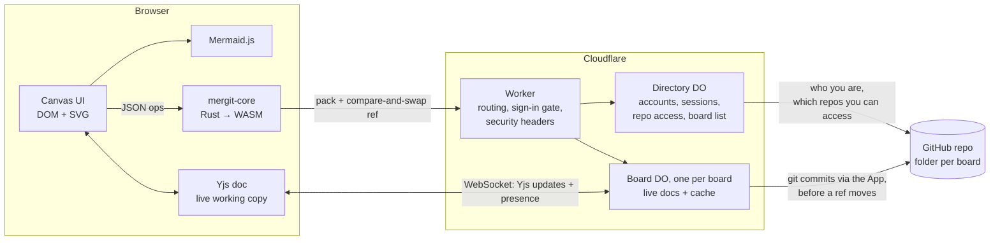

<p align="center"></p>

# mergit

Live, shared Mermaid whiteboards whose history lives in your GitHub repositories.

Every diagram on the infinite canvas is Mermaid text. People on the same branch edit
together in real time (cursors, selections, live typing), then **commit**, **branch**,
**merge** and browse **history**, with diffs that say *"added node Refunded"* rather
than *"+3 −1 lines"*. Every commit is a real git commit in a folder of a repo you choose.

- **Sign in with GitHub.** You see the boards in repositories you can access: write
  access means you can edit, read access means you can view.
- **Git is the source of truth.** A commit only counts once it's in the repo
  (`board.json` plus one `.mmd` file per diagram), and a board's whole history can be
  rebuilt from git.
- **A GitHub App does the writing,** with short-lived, repo-scoped tokens that stay on
  the server. Nobody handles tokens. The person is the commit's author; the app is the
  committer.
- **Rust → WebAssembly core** (content-addressed objects, branches, three-way merge,
  semantic diffs) runs in every browser.
- **Cloudflare** hosts it all: one Worker, a Durable Object per board, nothing else to run.

See [PLAN.md](PLAN.md) for design rationale and the roadmap.

---

## Contents

- [Quick start](#quick-start)
- [Using mergit](#using-mergit)
- [How it works](#how-it-works)
- [GitHub storage](#github-storage)
- [Hosting on Cloudflare](#hosting-on-cloudflare)
- [Security](#security)
- [Project layout](#project-layout)
- [Production readiness](#production-readiness)

## Quick start

**Requirements**

- Node 20+
- A **rustup-managed** Rust toolchain with the `wasm32-unknown-unknown` target.
  Homebrew's `rust` formula can't build WebAssembly; use `brew install rustup` (or
  [rustup.rs](https://rustup.rs)). The build scripts find rustup, including Homebrew's
  keg-only install, and add the target if it's missing.

```bash
npm install
npm run dev:fake-github   # everything, against a local fake GitHub: http://localhost:8787
npm test                  # Rust core tests + JS tests
```

`dev:fake-github` needs no GitHub App or repository. It runs
[`scripts/fake-github.mjs`](scripts/fake-github.mjs), an in-memory stand-in for the
parts of the GitHub API mergit uses (sign-in, app installations, git data), with real
JWT signature checks.

- **Signing in:** "Sign in with GitHub" shows a fake authorize page where you type any
  username. `viewer` gets read-only access and `outsider` gets none.
- **Repositories:** the fake app is installed on `acme/diagrams` and `acme/platform`.
- **Seeing what was written:** `curl http://127.0.0.1:8788/_log/acme/diagrams/main`.

To run against **real GitHub** locally, [register a GitHub App](#1-register-the-github-app)
(add `http://localhost:8787/auth/callback` as a callback URL), copy
[`.dev.vars.example`](.dev.vars.example) to `.dev.vars`, fill it in, and run `npm run dev`.

`wrangler dev` runs the real Workers runtime locally, Durable Objects and SQLite
included; data lives in `.wrangler/` (delete it to start fresh). Edits under `client/`
and `worker/` reload automatically. After changing `core/`, run `npm run build:wasm`.

**To try collaboration on one machine**, use `localhost:8787` in one tab and
`127.0.0.1:8787` in another. They're separate origins, so you can sign in as two
different people.

## Using mergit

| | |
|---|---|
| **Signing in** | "Sign in with GitHub". The home page lists boards in repositories you can access, marked *view only* where you have read access. |
| **New board** | Give it a name. It's saved to `boards/<name>/` in a repository the mergit app is installed on. **Change…** opens a folder browser: navigate the repo, create a new folder, or pick a folder that already holds a mergit board to import its history. If your repo isn't listed, **Add a repository** opens GitHub to install the app there. |
| **Canvas** | Drag empty space to pan; ⌘/Ctrl + scroll (or pinch) to zoom; `F` fits everything. Double-click empty space for a flowchart, or use **+ Diagram** for other templates. |
| **Editing** | Double-click a diagram (or select it and press `Enter`) to edit its Mermaid source; it re-renders as you type. Drag the header to move it, the bottom-right corner to resize, and press `⌫` to delete. |
| **Sharing** | **Share** copies the board URL. Anyone with access to the repository can open it. Everyone on a branch edits the same live copy, with avatars, cursors and selections. |
| **Commit** | Saves the branch's current state, for everyone, as a git commit (⌘↵ in the message box; it takes a second or two). Changed diagrams are outlined, and the panel shows a semantic diff (for flowcharts) plus a line diff. |
| **Branches** | **New** creates a branch from the current commit, optionally taking the uncommitted changes with it. Switching branches never discards anything: uncommitted work stays on its branch. |
| **Merge** | **Merge…** brings another branch into this one. Clean merges commit automatically. Conflicts are written as `%%` Mermaid comments, so the diagram still renders. Anyone on the branch can resolve them and commit to finish. |
| **History** | Click a commit to view the board as it was, with what that commit changed, and **GitHub ↗** to see the git commit. *Restore this version* brings it back as uncommitted changes; *Branch from here* starts a branch at that point. |
| **Export** | Downloads the board's history as one JSON file (*Import export…* on the home page turns one into a new board). |

## How it works



### Two layers of state

1. **History: commits and branches.** These are immutable, content-addressed objects,
   modelled on git, and stored in GitHub (see [GitHub storage](#github-storage)):

   | Object | Contents | Address |
   |---|---|---|
   | blob | one diagram's Mermaid source (whitespace-normalised) | SHA-256 of its JSON |
   | tree | a board snapshot: `[{ id, title, x, y, w, h, blob }]`, sorted by id | SHA-256 |
   | commit | `{ tree, parents[], message, author, time }` | SHA-256 |

   A **ref** maps a branch name to a commit. Frames keep stable ids, so moving a
   diagram shows as *moved*, not delete + add, and merges match frames by id.

2. **Live state: each branch's uncommitted working copy.** This is a Yjs document per
   `(board, branch)`. Each frame is a `Y.Map` (`title`, `x`, `y`, `w`, `h`, `z`), and its
   Mermaid source is a `Y.Text`, so two people typing in the same diagram merge
   character by character. A shared `meta` map holds in-progress merge state, so one
   person can start a merge and another can finish it. The schema lives in
   [`client/doc.js`](client/doc.js) and is shared by browser and server. This state
   changes on every keystroke, so it lives in the board's Durable Object, not in git.

### Identity and access

- **Sign-in** uses the GitHub App's user authorization (OAuth). The callback stores the
  person's GitHub user token in the Directory Durable Object and sets an opaque,
  random `HttpOnly` session cookie (`SameSite=Lax`, 30 days). Tokens are refreshed
  automatically.
- **Repo access** comes from GitHub: the repos the app is installed on that the person
  can access, with their permission level. It's cached for 5 minutes, and re-checked
  sooner when it's missing.
- **Every board request** passes through the Worker, which asks the Directory "who is
  this, and what may they do on this board's repo?". It forwards the answer to the
  board as headers it sets itself; the client can't supply them.
  - *write → edit:* live editing, committing, branching, merging.
  - *read → view:* everything visible; live edits and pushes are refused server-side.
  - *none:* 403.
- **Commit authorship is enforced.** The server refuses commits whose author isn't the
  signed-in person (except the imported history in a board's very first push). In
  git, the person is the author, with their GitHub noreply address, and the app is
  the committer.

### Who does what

- **The browser does all the version control.** The Rust core
  ([`core/`](core/src)) commits, diffs, three-way merges and builds history. It's
  compiled to a ~330 KB `.wasm` file with no imports, called through a tiny JSON ABI
  ([`client/core.js`](client/core.js)).
- **The Board Durable Object stores, relays and writes to GitHub; it never merges.** Per board, it:
  - checks every pushed object's SHA-256 and shape, and that a commit's whole history
    is present;
  - updates refs **only by compare-and-swap**, after writing the commits to GitHub.
    Ref updates are queued, so the check and the write happen as one step;
  - relays Yjs updates between editors on a branch, and persists them as an
    append-only log, compacted every 200 updates;
  - **seeds** a branch's live document from its head commit the first time it's
    opened. Seeding only happens on the server, so two clients can never both seed a
    document and duplicate its contents;
  - tracks presence (from the session, so names can't be faked) and uses
    **hibernatable WebSockets**, so idle boards cost nothing;
  - caches objects, refs and the mergit-to-git commit mapping. All of it can be rebuilt
    from GitHub.
- **The Directory Durable Object** holds accounts, sessions, cached repo access and the
  board list.

### Committing, step by step

1. The browser's core turns the live document into a commit (new blobs, tree, commit).
2. It **packs** the objects the server doesn't have yet.
3. `POST /refs { name, old, new, objects }`. The server checks your role, authorship,
   hashes and shapes; writes the commit to GitHub; and moves the branch **only if it
   still points at `old`**. If GitHub refuses, nothing moves and you see why.
4. On success, the server broadcasts `{type: "ref"}`, and every client fetches the new
   objects. The live document already matches the commit, so everyone on the branch
   goes "clean".
5. On `409`, someone else committed first. Your browser discards its local commit,
   fetches theirs, and asks you to review and commit again.

Merges follow the same path. A clean merge pushes a two-parent commit. A conflicted
merge writes the result, with markers, into the live document and records the merge
in the shared `meta`, and whoever commits next creates the merge commit.

### HTTP & WebSocket API

| Method & path | Purpose |
|---|---|
| `GET /auth/login?next=` → GitHub → `GET /auth/callback` | Sign in |
| `POST /auth/logout` | Sign out |
| `GET /api/me` | The signed-in person, plus the app's install URL |
| `GET /api/repos[?refresh]` | Repos the app can reach that you can access, with your permission |
| `GET /api/folders?repo=&path=` | Sub-folders of `path` (for the folder picker), and whether it holds a board |
| `GET /api/boards` | Boards in repos you can access, with your role |
| `POST /api/boards` `{name, repo, path}` | Create a board → `{id, imported}`. `imported` > 0 means its history was rebuilt from git. `409 {boardId}` if the folder already has a board. |
| `GET /api/boards/:id` | Name, refs, GitHub location, your role |
| `POST /api/boards/:id/pack` `{want, have}` | Objects reachable from `want`, not walking past commits in `have` |
| `POST /api/boards/:id/refs` `{name, old, new, objects}` | Push commits and compare-and-swap a branch (`new: null` deletes it). Editors only. |
| `GET /api/boards/:id/ws?branch=` | WebSocket for a branch's live document |
| `GET /api/boards/:id/github/commit/:hash` | Redirect to the git commit for a mergit commit |

Every write must come from our own pages: matching `Origin` and a JSON body.
WebSocket frames: **binary** frames are Yjs updates; **text** frames are JSON (server →
client `hello`, `synced`, `peers`, `ref`; client → server `presence`).

### Merging and diffing

- **Three-way, per frame**, against the most recent common ancestor. Diagram text uses
  a diff3 line merge. Title and geometry take whichever side changed. A delete on one
  side with an edit on the other is a conflict, and the edited version is kept.
- **Conflict markers are Mermaid comments** (`%% <<<<<<< main` …), so a conflicted
  diagram still renders, showing both sides.
- **Semantic diff** parses flowcharts into nodes and edges and reports what was added,
  removed or relabelled. Other diagram types fall back to line diffs.

## GitHub storage

Each board lives in one folder of one repository, on the repo's default branch:

```
acme/platform @ main
└── docs/diagrams/checkout-system/
    ├── board.json          frame ids, titles, positions, sizes, file names
    ├── README.md           generated; GitHub renders every diagram
    └── frames/
        ├── checkout-flow.mmd
        └── login-sequence.mmd
```

- **Every mergit commit is one git commit** that replaces just that folder, written
  through the Git Data API (4–6 calls). Trailers carry what git can't hold:

  ```
  Add express pay path

  Mergit-Commit: c9dbe15…   (the mergit hash: SHA-256 of the canonical object)
  Mergit-Parents: 1d73858…
  Mergit-Time: 1791301158790
  Mergit-Author: Sam
  ```

- **Branches:** mergit `main` maps to the repo's default branch. Every other mergit
  branch maps to `mergit/<folder-slug>/<name>`.
- **The rest of the repo is untouched.** Code and other commits can land on the same
  branch. mergit builds on top of them, so git branches only fast-forward.
- **Folders mergit didn't create are never overwritten.** A board can only go in a new
  folder, or one that already holds a mergit board (which imports its history). If
  someone edits a board's folder directly on GitHub, the next commit is refused with
  an explanation, and reverting the outside edit unblocks it. Importing outside edits
  is on the roadmap.
- **Recovery:** create a board on the same folder and mergit rebuilds its whole history
  from git, checking every commit's hash against its `Mergit-Commit` trailer
  ([`worker/git-store.js`](worker/git-store.js)). The JS object encoding is tested
  byte-for-byte against the Rust core ([`test/canonical.test.mjs`](test/canonical.test.mjs)).
- **One board per folder** is enforced.

## Hosting on Cloudflare

mergit is a single Worker with static assets and two Durable Object classes. It runs
on the Workers **Free** plan (SQLite-backed Durable Objects are included) or Paid plan.

### 1. Register the GitHub App

GitHub → Settings → Developer settings → **GitHub Apps → New GitHub App** (or under an
organisation's settings, to own it there):

| Setting | Value |
|---|---|
| GitHub App name | anything unique, e.g. `acme-mergit`; its URL slug is `GITHUB_APP_SLUG` |
| Homepage URL | your mergit URL |
| Callback URL | `https://<your-host>/auth/callback` (add `http://localhost:8787/auth/callback` too, for local dev) |
| Expire user authorization tokens | ✅ (mergit refreshes them) |
| Request user authorization (OAuth) during installation | optional |
| Webhook | uncheck **Active** (not used yet) |
| Repository permissions | **Contents: Read and write** (Metadata: Read is added automatically) |
| Where can this GitHub App be installed? | *Only on this account*, or *Any account* for other orgs |

After creating it, note the **App ID** and **Client ID**, **generate a client secret**,
and **generate a private key** (a `.pem` download). Then **Install App** on the
account or org, choosing the repositories boards may live in. People see only those
repos, and only the ones they can access themselves.

### 2. Configure and deploy

```bash
npx wrangler login
npx wrangler secret put GITHUB_CLIENT_SECRET
npx wrangler secret put GITHUB_APP_PRIVATE_KEY < path/to/app.private-key.pem
```

Set the public settings in `wrangler.jsonc` → `vars`: `GITHUB_APP_ID`,
`GITHUB_APP_SLUG`, `GITHUB_CLIENT_ID`. Then:

```bash
npm run deploy           # builds core + client, then `wrangler deploy`
```

The first deploy creates the Worker and the Durable Object migration, and prints a
`*.workers.dev` URL. Add it as the app's callback URL if you hadn't already.

**Optional:** a custom domain (`"routes": [{ "pattern": "diagrams.example.com",
"custom_domain": true }]`, or via the dashboard); logs with `npx wrangler tail` or
`"observability": { "enabled": true }`; CI deploys with a `CLOUDFLARE_API_TOKEN`.

**Data and backups.** Committed history is in your repositories, and boards can be
rebuilt from them. Only *uncommitted* live edits, sessions and cached access live
in Cloudflare (Durable Object SQLite, with point-in-time recovery).

**Changing the storage schema later:** Durable Object classes are versioned through
`migrations` in `wrangler.jsonc`, and table changes go in each class's constructor
(`CREATE TABLE IF NOT EXISTS …`). Add new tables or columns; never rename the classes.

## Security

What's in place:

- **No tokens in browsers.** The app's installation tokens (1 hour, scoped to the
  installed repos) and people's user tokens stay in Durable Objects. Browsers hold
  only an opaque, `HttpOnly` session cookie.
- **Access follows GitHub.** Every board request is authorised against the person's
  current permission on the board's repository; view-only users are enforced
  server-side. Board identity headers are set by the Worker, never taken from the
  client.
- **Authorship can't be forged.** Commit authors must match the session, and presence
  names come from the session.
- **Cross-site protection.** Writes and WebSocket upgrades must carry our own `Origin`
  and a JSON body. Sign-in uses a `state` cookie, and post-login redirects only go to
  local paths.
- **Headers on every response:** a strict Content-Security-Policy (scripts only from
  this origin, no inline scripts, no framing), `nosniff`,
  `Referrer-Policy: no-referrer`, `X-Frame-Options: DENY`, and HSTS over HTTPS.
  Mermaid runs with `securityLevel: "strict"`, and user text is inserted as text.
- **Limits:** request bodies up to 5 MB, live-edit messages up to 1 MB, and object
  shape and size checks on every push.
- **Repos are protected from mergit itself:** it never writes outside a board's folder,
  never takes over folders it didn't create, and only fast-forwards branches.

Known gaps are in the production checklist below.

## Project layout

```
core/            Rust crate (mergit-core), compiled to native for tests and to WASM for the browser
  src/repo.rs      objects, refs, commit, checkout, log, merge, pack/ingest for sync
  src/diff.rs      line diff, diff3 merge with %%-comment conflict markers
  src/mermaid.rs   lenient flowchart parser and semantic diff
  src/lib.rs       JSON request dispatch + the wasm ABI (gm_alloc / gm_call / gm_free)
client/          Browser code, bundled by esbuild into web/build/
  board.js         the board page: canvas, editor, version control panel, presence
  home.js          sign-in, board list, create dialog with repo + folder pickers
  doc.js           Yjs schema for a branch's live state (also used by the worker)
  sync.js          WebSocket session: Yjs updates + JSON control messages
  core.js          loads and calls the wasm core
worker/          Cloudflare Worker
  index.js         routing, sign-in gate, origin checks, security headers
  directory.js     Directory DO: accounts, sessions, repo access, board list
  board.js         Board DO: live documents, presence, ref updates, GitHub writes
  app-auth.js      GitHub App: JWTs, installation tokens, user sign-in
  git-store.js     mergit history ↔ git commits; rebuild from git
  github.js        minimal GitHub REST client
  objects.js       canonical mergit object encoding in JS (matches the Rust core)
web/             Static assets: index.html, board.html, style.css, logos
                 (pkg/, build/, vendor/ are generated by the build)
test/            JS tests (node --test); Rust tests live in core/
scripts/         build-wasm.sh, build-web.sh, cargo.sh (finds a rustup toolchain),
                 fake-github.mjs + dev-fake-github.sh (local GitHub stand-in)
```

## Production readiness

mergit works end to end against the local fake GitHub: sign-in, repo and folder pickers,
editing, commits, branches, merges, view-only and no-access users, forged-author and
cross-site refusals, and rebuilding from git. What's left:

### Must have

- [ ] **Test against real GitHub.** Register the app and run the full flow, including token
  refresh, an org that requires approval, and a large repo.
- [ ] **React to app changes.** Handle `installation` / `installation_repositories`
  webhooks (repos removed, app uninstalled), so boards whose repo is gone fail clearly
  and cached access is dropped immediately rather than within 5 minutes.
- [ ] **GitHub failure modes.** Retry transient 5xx and secondary rate limits with
  backoff. Show "GitHub is unavailable, commits are paused" clearly. Large histories
  may hit rate limits during a rebuild.
- [ ] **Encrypt user tokens at rest** in the Directory, with a key from a Worker secret,
  and add a "sign out everywhere" option.
- [ ] **Rate limiting** on `/api/*` and `/auth/*` (Cloudflare rate-limiting rules), and
  limits on boards per person.
- [ ] **CI.** On every PR: `cargo test`, build, the JS tests, and Worker tests. On merge to
  `main`: deploy.
- [ ] **Worker and end-to-end tests** in CI: `@cloudflare/vitest-pool-workers` for refs,
  rebuild, sessions and access, plus Playwright against the fake GitHub for the
  two-person flows.
- [ ] **Error reporting:** Workers observability, plus client-side error capture.
- [ ] **Delete and rename** for boards and branches in the UI.

### Should have

- [ ] **People without GitHub accounts:** email or Google sign-in plus workspace invites.
  Writes already go through the app, so they'd need no GitHub access at all.
- [ ] **Import outside edits** (e.g. a PR changing `.mmd` files) as mergit commits,
  merged into the live copy, instead of refusing them.
- [ ] **Choose a branch** other than the repo's default when creating a board.
- [ ] **Scale the Directory:** it's a single Durable Object, which is fine for a team
  but not for thousands of users. Shard sessions and accounts if needed.
- [ ] **Undo/redo** (Yjs `UndoManager`).
- [ ] **Offline resilience:** keep the live document in IndexedDB; send state-vector
  diffs on reconnect.
- [ ] **Scale the history:** fetch recent commits first, the rest lazily.
- [ ] **Document growth:** snapshot or garbage-collect Yjs documents after commits.
- [ ] **Protocol versioning,** so stale tabs get a "please reload" after a deploy.
- [ ] **Smaller downloads:** `wasm-opt` on the core, and loading only the Mermaid
  diagram types a board uses.
- [ ] **Accessibility and mobile:** keyboard navigation of frames, screen-reader labels,
  touch gestures.

### Features on the roadmap

- [ ] Semantic diff and merge for sequence, class, state and ER diagrams, and an
  in-diagram visual diff.
- [ ] A conflict resolver UI (ours / theirs / both per hunk, with previews).
- [ ] Comments pinned to diagrams and nodes, and a review flow ("propose changes" → merge).

## License

Not yet chosen. Add a `LICENSE` file before accepting outside contributions.
