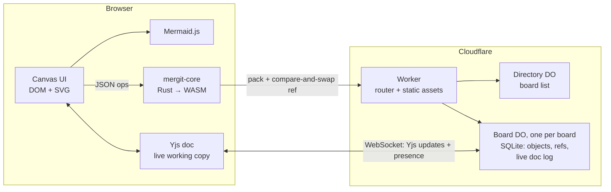

<p align="center"></p>

# mergit

Live, shared Mermaid whiteboards with git-style version control.

Every diagram on the infinite canvas is Mermaid text. People on the same branch edit
together in real time (cursors, selections, live typing), then **commit**, **branch**,
**merge** and browse **history**, with diffs that say *"added node Refunded"* rather
than *"+3 −1 lines"*.

- **Rust → WebAssembly core**: content-addressed object store, branches, three-way
  merge, line and semantic diffs. One crate, run in every browser.
- **Cloudflare backend**: one Worker plus one Durable Object per board. No database to
  run, no servers to manage.
- **Yjs** for real-time co-editing of each branch's uncommitted state.

See [PLAN.md](PLAN.md) for the full design rationale and roadmap.

---

## Contents

- [Quick start](#quick-start)
- [Using mergit](#using-mergit)
- [How it works](#how-it-works)
- [Hosting on Cloudflare](#hosting-on-cloudflare)
- [Project layout](#project-layout)
- [Production readiness](#production-readiness)

## Quick start

**Requirements**

- Node 20+
- A **rustup-managed** Rust toolchain with the `wasm32-unknown-unknown` target.
  Homebrew's `rust` formula can't build WebAssembly; use `brew install rustup` (or
  [rustup.rs](https://rustup.rs)). The build scripts find rustup, including Homebrew's
  keg-only install, and add the target if it's missing.

```bash
npm install
npm run dev        # build the core + client, then run `wrangler dev` on http://localhost:8787
npm test           # Rust unit tests for the core
```

`wrangler dev` runs the real Workers runtime (`workerd`) locally, including Durable
Objects and their SQLite storage. Local data lives in `.wrangler/`; delete that folder
to start fresh. Edits under `client/` rebuild automatically. After changing `core/`,
run `npm run build:wasm` and reload.

**To try collaboration on one machine**, open the same board at `localhost:8787` in one
tab and `127.0.0.1:8787` in another. They're different origins, so each keeps its own
display name.

## Using mergit

| | |
|---|---|
| **Boards** | The home page lists boards. *New example board* creates one with history and a `feature/express-pay` branch you can merge. *Import export…* turns a `.mergit.json` export into a new board. |
| **Canvas** | Drag empty space to pan; ⌘/Ctrl + scroll (or pinch) to zoom; `F` fits everything. Double-click empty space to add a flowchart, or use **+ Diagram** for other templates. |
| **Editing** | Double-click a diagram (or select it and press `Enter`) to edit its Mermaid source; it re-renders as you type. Drag the header to move it, drag the bottom-right corner to resize, and press `⌫` to delete. |
| **Sharing** | **Share** copies the board URL. Everyone on the same branch edits the same live copy and sees each other's avatars, cursors and selections. |
| **Commit** | Snapshots the branch's current state for everyone (⌘↵ in the message box). Changed diagrams are outlined, and the panel shows a semantic diff (for flowcharts) plus a line diff. |
| **Branches** | **New** creates a branch from the current commit, optionally taking the uncommitted changes with it. Switching branches never discards anything: uncommitted work stays on its branch. |
| **Merge** | **Merge…** brings another branch into this one. Clean merges commit automatically. Conflicts are written as `%%` Mermaid comments, so the diagram still renders. Anyone on the branch can resolve them and commit to finish. |
| **History** | Click a commit to view the board as it was, with what that commit changed. *Restore this version* brings it back as uncommitted changes; *Branch from here* starts a branch at that point. |
| **Export** | Downloads the board's entire history as one JSON file. |

Your display name is asked for once and stored in the browser. It appears on your
avatar and on your commits.

## How it works



### Two layers of state

1. **History: commits and branches.** These are immutable, content-addressed objects,
   modelled on git:

   | Object | Contents | Address |
   |---|---|---|
   | blob | one diagram's Mermaid source (whitespace-normalised) | SHA-256 of its JSON |
   | tree | a board snapshot: `[{ id, title, x, y, w, h, blob }]`, sorted by id | SHA-256 |
   | commit | `{ tree, parents[], message, author, time }` | SHA-256 |

   A **ref** maps a branch name to a commit. Frames keep stable ids, so moving a
   diagram shows as *moved*, not delete + add, and merges match frames by id.

2. **Live state: each branch's uncommitted working copy.** This is a Yjs document per
   `(board, branch)`. Each frame is a `Y.Map` (`title`, `x`, `y`, `w`, `h`, `z`), and its
   Mermaid source is a `Y.Text`, so two people typing in the same diagram merge
   character by character. A shared `meta` map holds in-progress merge state, so one
   person can start a merge and another can finish it. The schema lives in
   [`client/doc.js`](client/doc.js) and is shared by browser and server.

   "Uncommitted changes" means the difference between this document and the branch's
   head commit. It's computed in each browser by the core.

### Who does what

- **The browser does all the version control.** The Rust core
  ([`core/`](core/src)) commits, diffs, three-way merges and builds history. It's
  compiled to a ~330 KB `.wasm` file with no imports, called through a tiny JSON ABI
  ([`client/core.js`](client/core.js)).
- **The Board Durable Object stores and relays; it never merges.** Per board, it:
  - stores objects exactly as the core serialised them, after checking each one's
    SHA-256;
  - updates refs **only by compare-and-swap** (`old` must match the current value);
  - relays Yjs updates between everyone on a branch, and persists them as an
    append-only log, compacted into a snapshot every 200 updates;
  - **seeds** a branch's live document from its head commit the first time it's
    opened. Seeding only happens on the server, so two clients can never both seed
    a document and duplicate its contents;
  - tracks presence (name, colour, branch, selection, cursor) and broadcasts it;
  - uses **hibernatable WebSockets**, so idle boards cost nothing, and rebuilds its
    in-memory documents from SQLite when it wakes.
- **The Directory Durable Object** is a single instance that lists boards and creates
  new ones.

### Committing, step by step

1. The browser's core turns the live document into a commit (new blobs, tree, commit).
2. It **packs** the objects the server doesn't have yet (everything reachable from
   the new commit, minus what's reachable from known server branches).
3. `POST /refs { name, old, new, objects }`. The server verifies the hashes, stores the
   objects, and moves the branch **only if it still points at `old`**.
4. On success, the server broadcasts `{type: "ref"}`. Every client fetches the new
   objects and updates its view. The live document already matches the commit, so
   everyone on the branch goes "clean".
5. On `409`, someone else committed first. The browser discards its local commit,
   fetches theirs, and asks you to review and commit again. History never forks by
   accident.

Merges follow the same path. A clean merge pushes a two-parent commit. A conflicted
merge writes the result, with markers, into the live document and records the merge
in the shared `meta`, and whoever commits next creates the merge commit.

### HTTP & WebSocket API

All board routes are handled by that board's Durable Object.

| Method & path | Purpose |
|---|---|
| `GET /api/boards` | List boards |
| `POST /api/boards` `{name}` | Create a board → `{id}` |
| `GET /api/boards/:id` | Board name + all refs |
| `POST /api/boards/:id/pack` `{want, have}` | Objects reachable from `want`, not walking past commits in `have` |
| `POST /api/boards/:id/refs` `{name, old, new, objects, by}` | Upload objects and compare-and-swap a branch (`new: null` deletes it). `409 {current}` if it moved. |
| `GET /api/boards/:id/ws?branch=&name=&color=` | WebSocket for a branch's live document |

WebSocket frames: **binary** frames are Yjs updates (both directions). **Text** frames are
JSON: server → client `hello`, `synced`, `peers`, `ref`; client → server `presence`.

### Merging and diffing

- **Three-way, per frame**, against the most recent common ancestor. Diagram text uses
  a diff3 line merge. Title and geometry take whichever side changed. A delete on one
  side with an edit on the other is a conflict, and the edited version is kept.
- **Conflict markers are Mermaid comments** (`%% <<<<<<< main` …), so a conflicted
  diagram still renders, showing both sides.
- **Semantic diff** parses flowcharts into nodes and edges and reports what was
  added, removed or relabelled. Other diagram types fall back to line diffs.

## Hosting on Cloudflare

mergit is a single Worker with static assets and two Durable Object classes, so it runs
on the Workers **Free** plan (SQLite-backed Durable Objects are included) or Paid plan.

```bash
npx wrangler login     # once
npm run deploy         # builds core + client, then `wrangler deploy`
```

The first deploy creates the `mergit` Worker, applies the Durable Object migration
(`v1`, SQLite-backed `Board` and `Directory`), uploads `web/` as static assets, and
prints a `*.workers.dev` URL.

**Then, before sharing it, add access control.** There's no built-in auth yet (see
below). The quickest safe option is
[Cloudflare Access](https://developers.cloudflare.com/cloudflare-one/applications/configure-apps/self-hosted-public-app/)
in front of the whole hostname, allowing your team's email domain or an identity
provider. It's free for up to 50 users and needs no code changes.

**Optional:**

- **Custom domain:** add `"routes": [{ "pattern": "diagrams.example.com", "custom_domain": true }]`
  to `wrangler.jsonc`, or attach it in the dashboard (Workers → mergit → Settings →
  Domains & Routes).
- **Logs:** `npx wrangler tail` streams live logs. Enable Workers Logs in
  `wrangler.jsonc` (`"observability": { "enabled": true }`) to keep them.
- **CI deploys:** the build needs Rust with the wasm target, Node, and a
  `CLOUDFLARE_API_TOKEN` with *Workers Scripts: Edit*. The production checklist
  below sketches the workflow.

**Data and backups.** Each board's data lives in its own Durable Object's SQLite
database, stored by Cloudflare. Durable Object SQLite storage supports point-in-time
recovery for recent history, but there's no scheduled off-platform backup yet. For now,
**Export** on a board downloads its complete history. The planned GitHub mirror (see
[PLAN.md §8](PLAN.md#8-storage--github)) adds a human-readable copy of each board as a
folder of `.mmd` files.

**Changing the storage schema later:** Durable Object classes are versioned through
`migrations` in `wrangler.jsonc`, and table changes go in each class's constructor
(`CREATE TABLE IF NOT EXISTS …`). Add new tables or columns; never rename the classes.

## Project layout

```
core/            Rust crate (mergit-core), compiled to native for tests and to WASM for the browser
  src/repo.rs      objects, refs, commit, checkout, log, merge, pack/ingest for sync
  src/diff.rs      line diff, diff3 merge with %%-comment conflict markers
  src/mermaid.rs   lenient flowchart parser and semantic diff
  src/lib.rs       JSON request dispatch + the wasm ABI (gm_alloc / gm_call / gm_free)
client/          Browser code, bundled by esbuild into web/build/
  board.js         the board page: canvas, editor, version control panel, presence
  home.js          board list, create, import
  doc.js           Yjs schema for a branch's live state (also used by the worker)
  sync.js          WebSocket session: Yjs updates + JSON control messages
  core.js          loads and calls the wasm core
worker/          Cloudflare Worker
  index.js         router: /api/* → Durable Objects, /b/:id → board page, everything else → assets
  board.js         Board Durable Object (objects, refs, live documents, presence)
  directory.js     Directory Durable Object (board list)
web/             Static assets: index.html, board.html, style.css, logos
                 (pkg/, build/, vendor/ are generated by the build)
scripts/         build-wasm.sh, build-web.sh, cargo.sh (finds a rustup toolchain)
```

## Production readiness

mergit works end to end, and the core flows are tested in a real browser against the
local Workers runtime. Here's what's left before it should hold anyone's real work,
roughly in priority order.

### Must have

- [ ] **Authentication.** Today anyone with the URL can list every board and edit it.
  Start with Cloudflare Access in front of the app. Then **take identity from the
  verified Access JWT** (`Cf-Access-Jwt-Assertion`) in the Worker, rather than the
  client-supplied name, for both commit authors and presence.
- [ ] **Authorisation.** Per-board membership and roles (viewer / editor / owner), read-only
  share links, and checks on every route *and* on WebSocket upgrade. The board list
  should only show your boards.
- [ ] **Server-side commit authorship.** The server currently trusts the `author` field
  inside commits. It should stamp or verify it against the authenticated user.
- [ ] **Limits and abuse protection.** Cap object size, objects per push, live-document
  size, WebSocket message size and rate, and boards per user. Add Workers rate-limiting
  rules on `/api/*`.
- [ ] **Deeper validation of pushes.** Hashes are verified, but objects aren't
  schema-checked, and the server doesn't confirm that a pushed commit's tree, blobs
  and parents all exist. A malformed push could break a board for everyone.
- [ ] **Delete and rename** for boards and branches (the API can delete a branch; the UI
  can't), with confirmation and recovery.
- [ ] **Backups off-platform.** Scheduled export of each board (for example to R2), or
  the GitHub mirror, plus a tested restore path.
- [ ] **CI.** On every PR: `cargo test`, build the WASM and bundle, and run Worker tests.
  On merge to `main`: deploy, with the Cloudflare API token as a secret.
- [ ] **Tests beyond the core.** Worker tests with `@cloudflare/vitest-pool-workers` (ref
  compare-and-swap, pack walks, document seeding and compaction, hibernation), plus a
  Playwright suite for the two-user flows checked by hand so far: live edit, commit
  race, shared merge resolution, branch carry, and a restart.
- [ ] **Error reporting.** Enable Workers Logs/observability, and add client-side error
  reporting (e.g. Sentry) so failed pushes and render errors are visible.

### Should have

- [ ] **Undo/redo** (Yjs `UndoManager`, scoped to your own changes).
- [ ] **Offline resilience.** Persist the live document in IndexedDB (`y-indexeddb`) so a
  closed tab doesn't lose unsynced edits. Send a state-vector diff on reconnect rather
  than the whole document.
- [ ] **Scale the history.** Opening a board downloads its entire history. Fetch
  recent commits first and the rest lazily, and keep objects in IndexedDB between visits.
- [ ] **Document growth.** Snapshot or garbage-collect each branch's Yjs document after
  commits, so tombstones don't pile up on long-lived branches.
- [ ] **Presence efficiency.** Presence is broadcast to the whole board on every cursor
  move. Send it only to the same branch, and send deltas.
- [ ] **Protocol versioning.** Add a version to the WebSocket handshake and API so old tabs
  get a clear "please reload" after a deploy, not subtle breakage.
- [ ] **Security headers.** A Content-Security-Policy (scripts from self only), plus
  `X-Content-Type-Options` and a referrer policy. Mermaid already runs with
  `securityLevel: "strict"`, and user text is rendered with `textContent`.
- [ ] **Smaller downloads.** Run `wasm-opt` on the core. Only load the Mermaid diagram types
  a board uses (the vendored Mermaid is ~3.6 MB).
- [ ] **Accessibility and mobile.** Keyboard navigation of frames, screen-reader labels,
  and touch gestures (pinch zoom, long-press).

### Features on the roadmap

- [ ] **GitHub mirror** (design in [PLAN.md §8](PLAN.md#8-storage--github)): a folder per
  board in a repo you choose, one git commit per mergit commit, pushed from a Durable
  Object alarm. Later, two-way sync from PRs.
- [ ] **Semantic diff and merge** for sequence, class, state and ER diagrams, and an
  in-diagram visual diff (highlight added and removed nodes).
- [ ] **A conflict resolver UI**: pick ours / theirs / both per hunk, with live previews.
- [ ] **Comments** pinned to diagrams and nodes, and a review flow ("propose changes" → merge).

## License

Not yet chosen. Add a `LICENSE` file before accepting outside contributions.
